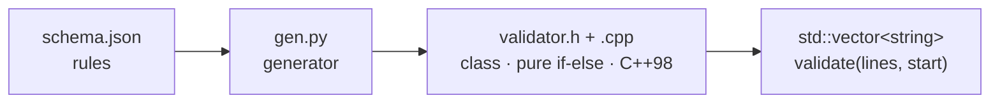
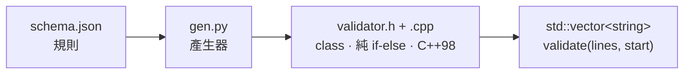

# schema2validator


**English** | [中文](#chinese)

> Describe your tag-format rules in one Schema, and auto-generate a **pure if-else** C++98 validator.

`schema2validator` is a small code generator (essentially a mini-compiler): **Schema is the source language, C++98 is the target.** You maintain only `schema.json`; running the generator produces a self-contained, auditable validator **class** (`.h` + `.cpp`, all member functions) — no hand-written validation logic required. The generated class has no `main`: it takes a `std::vector<std::string>` (one line per element) and can start validating from any index.

## Features

- **Pure if-else output** — Every structural rule is flattened into `if / else if`, each carrying an error code and comment for easy auditing.
- **C++98, no STL in the rules** — Suitable for legacy toolchains and embedded targets; the `std::string`/`std::vector` can be swapped for C arrays if needed.
- **Data-driven rules** — Add or change rules by editing `schema.json` only; re-run the generator without touching C++.
- **Delimiters declared by the Schema** — Each node states its own `start` / `end` strings; `<>` and `[]` can be freely mixed, and the parser only matches literal strings.
- **Reports all errors at once** — Does not stop at the first error; every entry carries an error code and line number.
- **Even regex compiles to if-else** — `pattern` is compiled into a character-by-character matcher, with no need for `<regex>`.

## How it works



Internal pipeline of the generated class:

```
tokenize  →  build scope tree  →  structural check  →  semantic check (if-else)  →  collect all errors
```

Structure and semantics are deliberately separated: if the structure is broken, the tree cannot be built and semantic checks become moot.

## Quick start

Requirements: Python 3, and a C++98-capable compiler (g++ / clang++).

```bash
# 1) Generate the validator class (4th arg = class name, default Validator)
python3 gen.py schema.json validator.h validator.cpp Validator

# 2) Compile to an object file and link with your program
g++ -std=c++98 -c validator.cpp -o validator.o
```

Then use the class from your own code:

```cpp
#include "validator.h"

std::vector<std::string> lines = /* one line per element */;
Validator v;
bool ok = v.validate(lines);            // validate from the start
// or: v.validate(lines, startIndex);   // start at a given index

if (!ok) {
    const std::vector<ValidationError>& errs = v.errors();  // code / line / message
    // errs[i].line is the index into `lines` (absolute, 0-based)
}
```

`validate` returns `true` when fully valid; otherwise errors are collected in `errors()` for the caller to render (no `std::cout`). The same object can be reused; each call clears the previous errors.

## Schema at a glance

`schema.json` has two top-level fields: `root` (the single outermost node name) and `nodes`.

```json
{
  "root": "PROGRAM",
  "nodes": {
    "PROGRAM": {
      "start": "<PROGRAM>",
      "end": "</PROGRAM>",
      "attributes": {
        "P_NAME": { "required": true, "pattern": "^P[0-9]+$" }
      },
      "children": {
        "VAR_SECTOR": { "min": 1, "max": 1 }
      }
    },
    "VAR_SECTOR": {
      "start": "[VAR_SECTOR_START]",
      "end": "[VAR_SECTOR_END]",
      "children": { "VAR": { "min": 1 } }
    },
    "VAR": {
      "start": "<VAR>",
      "end": "</VAR>",
      "attributes": {
        "V_NAME": { "required": true, "unique": true }
      }
    }
  }
}
```

|Block    |Field          |Description                                                      |
|---------|---------------|-----------------------------------------------------------------|
|Node     |`start` / `end`|**Required.** The node’s opening/closing marker (full line).     |
|Attribute|`required`     |Attribute must be present.                                       |
|Attribute|`pattern`      |Value must match a bounded-regex subset.                         |
|Attribute|`unique`       |Value must not repeat among same-type siblings in the same scope.|
|Child    |`min` / `max`  |Min/max occurrences (`-1` or omitted = unlimited).               |


> Full field definitions, supported `pattern` syntax, and generated-code samples are in <SCHEMA_GUIDE.md>.

## Example

Input lines (as a `std::vector<std::string>`):

```
<PROGRAM>
P_NAME=P1
[VAR_SECTOR_START]
<VAR>
V_NAME=alpha
</VAR>
[VAR_SECTOR_END]
</PROGRAM>
```

For invalid input, `errors()` yields entries the caller can print (`line` = vector index, 0-based):

```text
[E001] line 0: missing required attribute P_NAME in PROGRAM
[E004] line 0: too many VAR_SECTOR in PROGRAM (max 1)
[E006] line 2: missing required attribute V_NAME in VAR
```

The generated rules are member functions, plain if-else (excerpt):

```cpp
int Validator::check_VAR(const Node* node) {
    int errs = 0;
    /* E006: V_NAME required */
    if (hasAttr(node, "V_NAME") == 0) {
        addError(node->line, "E006", "missing required attribute V_NAME");
        errs = errs + 1;
    }
    /* E007: V_NAME must be unique among siblings */
    if (hasEarlierSiblingSameAttr(node, "V_NAME") == 1) {
        addError(node->line, "E007", "duplicate V_NAME (must be unique in scope)");
        errs = errs + 1;
    }
    return errs;
}
```

## Error codes

|Code   |Description                                                                  |
|-------|-----------------------------------------------------------------------------|
|`E001`+|Auto-numbered by schema rule order; the message text is the stable reference.|
|`E900` |End marker not matched.                                                      |
|`E902` |Attribute outside any scope.                                                 |
|`E903` |Scope not closed.                                                            |
|`E904` |Top level is not exactly one root node.                                      |

## Project structure

```
.
├── gen.py             # Generator: schema.json -> validator.h + .cpp
├── validator.h        # Generated class header (auto-generated, do not edit)
├── validator.cpp      # Generated class implementation (auto-generated, do not edit)
├── schema.json        # Rule definitions (example)
├── example_usage.cpp  # Sample driver showing how to call the class
└── SCHEMA_GUIDE.md    # Full schema authoring guide
```

> `validator.h` / `validator.cpp` are generated by `gen.py`; any manual edit is overwritten on the next run. To change behavior, edit `schema.json` or `gen.py`.
> ├── schema.json        # Rule definitions (example)
> ├── validator.cpp      # Generated validator (auto-generated, do not edit)
> ├── SCHEMA_GUIDE.md    # Full schema authoring guide

## Limitations & roadmap

Currently supported `pattern` subset: anchors `^ $`, literal characters, character classes `[a-z0-9_]` (with ranges), quantifiers `+ * ?`.

Not yet supported, open for extension:

- `pattern`: alternation `|`, groups `()`, negated classes `[^...]`, shorthand `\d`.
- Document-wide uniqueness.
- Enforcing `start/end` form, attribute occurrence counts and ordering.
- Embedded build: C arrays instead of `std::string`/`std::vector`, zero dynamic allocation.

> Parsing is line-based (one line = one token, split on `\n`): `start`/`end` markers and `KEY=VALUE` attributes must each occupy their own line (surrounding whitespace is trimmed). A `start`/`end` marker is matched by **exact full-line string equality**, so it cannot share a line with anything else.
> 
> Any line that matches no declared `start`/`end` marker and contains no `=` is **silently ignored** — undeclared tags and free text simply pass through and do not cause errors.

## Credits

This project — including the generator, the C++98 validator design, the schema format, and this documentation — was generated by **Claude (Claude Opus 4.8)** by Anthropic, through an iterative design conversation.

## License

[MIT License](LICENSE).

-----

<a id="chinese"></a>

# schema2validator(中文)

[English](#schema2validator) | **中文**

> 用一份 Schema 描述標籤格式規則,自動產生「純 if-else」的 C++98 驗證器。

`schema2validator` 是一個小型程式碼產生器(本質上是迷你編譯器):**Schema 是來源語言,C++98 是目標語言**。你只維護 `schema.json`,跑一次產生器就得到一個自足、可稽核的驗證器 **class**(`.h` + `.cpp`,所有函式皆為 member function),完全不必手寫驗證邏輯。產生的 class 不含 `main`,以 `std::vector<std::string>`(每個元素一行)為輸入,並可指定起始索引。

## 特色

- **產出即純 if-else** — 所有結構規則攤平成 `if / else if`,每個判斷掛著錯誤碼與註解,方便對照與稽核。
- **C++98、規則段無 STL 依賴** — 適合舊工具鏈與嵌入式;`std::string`/`std::vector` 可自行替換成 C 陣列。
- **規則資料驅動** — 新增/修改規則只動 `schema.json`,重跑產生器即可,不碰 C++。
- **分隔符完全由 Schema 宣告** — 每個節點寫出自己的 `start` / `end` 字串,`<>` 與 `[]` 可自由混用,解析器只比對字面字串。
- **一次列出所有錯誤** — 不在第一個錯誤就停止,每筆都帶錯誤碼與行號。
- **連 Regex 都編成 if-else** — `pattern` 會被編成逐字元的字元比對函式,無需 `<regex>`。

## 運作方式



產生 class 的內部流程:

```
切詞  →  建立範圍樹  →  結構檢查  →  語意檢查 (if-else 規則)  →  收集所有錯誤
```

結構與語意刻意分開:結構壞掉就建不出樹,語意檢查也無從談起。

## 快速開始

需求:Python 3、支援 C++98 的編譯器(g++ / clang++)。

```bash
# 1) 產生驗證器 class(第四個參數為 class 名稱,省略則預設 Validator)
python3 gen.py schema.json validator.h validator.cpp Validator

# 2) 編成目的檔,與你的程式連結
g++ -std=c++98 -c validator.cpp -o validator.o
```

接著在你的程式裡使用:

```cpp
#include "validator.h"

std::vector<std::string> lines = /* 每個元素一行 */;
Validator v;
bool ok = v.validate(lines);            // 從頭檢查
// 或: v.validate(lines, startIndex);   // 從指定索引開始檢查到結尾

if (!ok) {
    const std::vector<ValidationError>& errs = v.errors();  // 每筆: code / line / message
    // errs[i].line 為 lines 向量中的索引(絕對, 0 起算)
}
```

`validate` 回傳 `true` 表示完全合法;否則錯誤收進 `errors()`,由呼叫端決定如何呈現(不再用 `std::cout`)。同一物件可重複呼叫,每次會先清空上一輪錯誤。

## Schema 速覽

`schema.json` 有兩個頂層欄位:`root`(最外層唯一節點名稱)與 `nodes`。

```json
{
  "root": "PROGRAM",
  "nodes": {
    "PROGRAM": {
      "start": "<PROGRAM>",
      "end": "</PROGRAM>",
      "attributes": {
        "P_NAME": { "required": true, "pattern": "^P[0-9]+$" }
      },
      "children": {
        "VAR_SECTOR": { "min": 1, "max": 1 }
      }
    },
    "VAR_SECTOR": {
      "start": "[VAR_SECTOR_START]",
      "end": "[VAR_SECTOR_END]",
      "children": { "VAR": { "min": 1 } }
    },
    "VAR": {
      "start": "<VAR>",
      "end": "</VAR>",
      "attributes": {
        "V_NAME": { "required": true, "unique": true }
      }
    }
  }
}
```

|區塊 |欄位             |說明                        |
|---|---------------|--------------------------|
|節點 |`start` / `end`|**必填**,該節點的起訖標記整行字串。      |
|屬性 |`required`     |屬性必須存在。                   |
|屬性 |`pattern`      |值需符合有界 regex 子集。          |
|屬性 |`unique`       |同一上層範圍、同類節點中此屬性值不可重複。     |
|子節點|`min` / `max`  |出現次數下限/上限(`-1` 或省略 = 無上限)。|


> 完整欄位定義、`pattern` 支援語法、產生程式碼範例請見 <SCHEMA_GUIDE.md>。

## 範例

輸入(以 `std::vector<std::string>` 傳入,每個元素一行):

```
<PROGRAM>
P_NAME=P1
[VAR_SECTOR_START]
<VAR>
V_NAME=alpha
</VAR>
[VAR_SECTOR_END]
</PROGRAM>
```

不合法輸入時,`errors()` 會給出可由呼叫端印出的項目(`line` = 向量索引,0 起算):

```text
[E001] line 0: PROGRAM 範圍內缺少必要屬性 P_NAME
[E004] line 0: PROGRAM 範圍內 VAR_SECTOR 數量過多 (上限 1)
[E006] line 2: VAR 範圍內缺少必要屬性 V_NAME
```

產生出的規則是 member function,純 if-else(節錄):

```cpp
int Validator::check_VAR(const Node* node) {
    int errs = 0;
    /* E006: 屬性 V_NAME 必填 */
    if (hasAttr(node, "V_NAME") == 0) {
        addError(node->line, "E006", "VAR 範圍內缺少必要屬性 V_NAME");
        errs = errs + 1;
    }
    /* E007: 屬性 V_NAME 須唯一 (同範圍內同類節點不可重複) */
    if (hasEarlierSiblingSameAttr(node, "V_NAME") == 1) {
        addError(node->line, "E007", "VAR 的 V_NAME 值重複 (同範圍內須唯一)");
        errs = errs + 1;
    }
    return errs;
}
```

## 錯誤碼

|範圍     |說明                              |
|-------|--------------------------------|
|`E001`+|由 schema 規則依產生順序自動編號,訊息文字才是穩定依據。|
|`E900` |結束標記未正確配對。                      |
|`E902` |屬性出現在任何範圍之外。                    |
|`E903` |範圍未關閉。                          |
|`E904` |文件頂層不是恰好一個 root 節點。             |

## 專案結構

```
.
├── gen.py             # 產生器:schema.json -> validator.h + .cpp
├── validator.h        # 產生出的 class 標頭(自動生成,請勿手動修改)
├── validator.cpp      # 產生出的 class 實作(自動生成,請勿手動修改)
├── schema.json        # 規則定義(範例)
├── example_usage.cpp  # 示範如何呼叫 class 的範例程式
└── SCHEMA_GUIDE.md    # Schema 撰寫完整說明
```

> `validator.h` / `validator.cpp` 由 `gen.py` 自動產生,任何修改都會在重新產生時被覆蓋。要改行為請改 `schema.json` 或 `gen.py`。

## 限制與後續方向

目前 `pattern` 支援的子集:錨點 `^ $`、字面字元、字元類別 `[a-z0-9_]`(含範圍)、量詞 `+ * ?`。

尚未支援、可再擴充:

- `pattern`:選擇 `|`、群組 `()`、否定類別 `[^...]`、簡寫 `\d`。
- document-wide unique(跨範圍唯一性)。
- 強制 `start/end` 形式、屬性出現次數與順序檢查。
- 嵌入式版本:改用 C 陣列取代 `std::string`/`std::vector`、零動態配置。

> 解析以「整行」為單位(一行 = 一個 token,以 `\n` 切分):`start`/`end` 標記與 `KEY=VALUE` 屬性都需各自獨立成行(前後空白會自動修剪)。`start`/`end` 標記採**整行字串完全相等**比對,因此不能與其他內容寫在同一行。
> 
> 任何「比不中已宣告 start/end、又不含 `=`」的行會被**靜默忽略** — 未設定的標籤與自由文字都會直接通過,不會產生錯誤。

## 致謝

本專案 — 包含產生器、C++98 驗證器設計、Schema 格式與本份說明文件 — 由 Anthropic 的 **Claude(Claude Opus 4.8)** 透過多輪設計對話產生。

## 授權

[MIT License](LICENSE)。